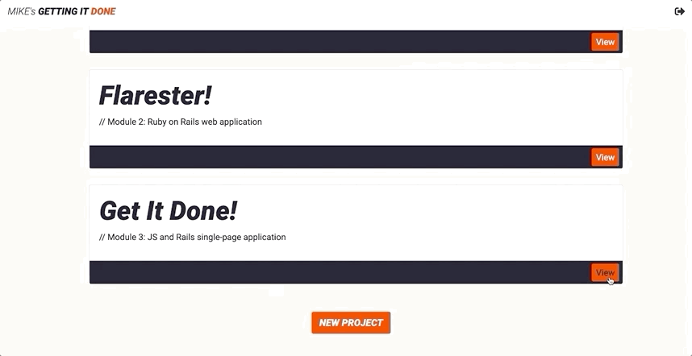

# README

*GET IT DONE* is a simple project tracker -- name your project, state its gist, and maintain a collection of notes. 
  
 Users can **create** new and **view** current projects from the app's dashboard.
 Options to **update** or **complete** (and remove from list) are available on the project's show card. 
 
 Future functionality will allow users to keep track of progress/to-do's with an integrated 'deliverables' list.
 Ability to display web addresses and photo tiles will also be implemented. 

                                            Create a new project

-----------------------------------------------------------------------------------------------------------------------------------

                                         Update an existing project

-----------------------------------------------------------------------------------------------------------------------------------

                                          Delete completed projects

-----------------------------------------------------------------------------------------------------------------------------------

**The app uses these versions:**
- Ruby  version 2.6.1p33
- Rails version 5.2.3

**Install lite-server**
>Lightweight development only node server that serves a web app, opens it in the browser, refreshes when html or javascript change, >injects CSS changes using sockets, and has a fallback page when a route is not found.

- https://www.npmjs.com/package/lite-server

(alternatively, you can just paste the path to index.html into your browser's address bar)

**Once you've cloned the repo, make sure to run the following commands from the app's directory:**
 - `bundle install`
 - `rails db:create`
 - `rails db:migrate`
 - `rails db:seed`
    - (check out app/db/seeds.rb -- you can customize and add your own user and project objects here; the ability to add a user from the front-end is yet to be implemented)
 
 
**Run the app**
-After you've completed the steps listed above, run `rails s` 
-If you installed lite-server, open another terminal and type `lite-server`, otherwise, just paste the path as mentioned above.
 

* There is no test suite
* Props to the guys and girls at https://hipsum.co/ -- thanks for the hilarity
* Also, shout out to the peeps who contribute to https://fonts.google.com/ (*GET IT DONE* uses Roboto) & https://fontawesome.com/?from=io (exit icon and back arrows). Thank you
* OH, AND... almost forgot, https://coolors.co/ . Color matching made easy. Super cool UI, too

Thanks for stopping by :thumbsup: 

                    “Experience is the name everyone gives to their mistakes.” 
                                                                               – Oscar Wilde
